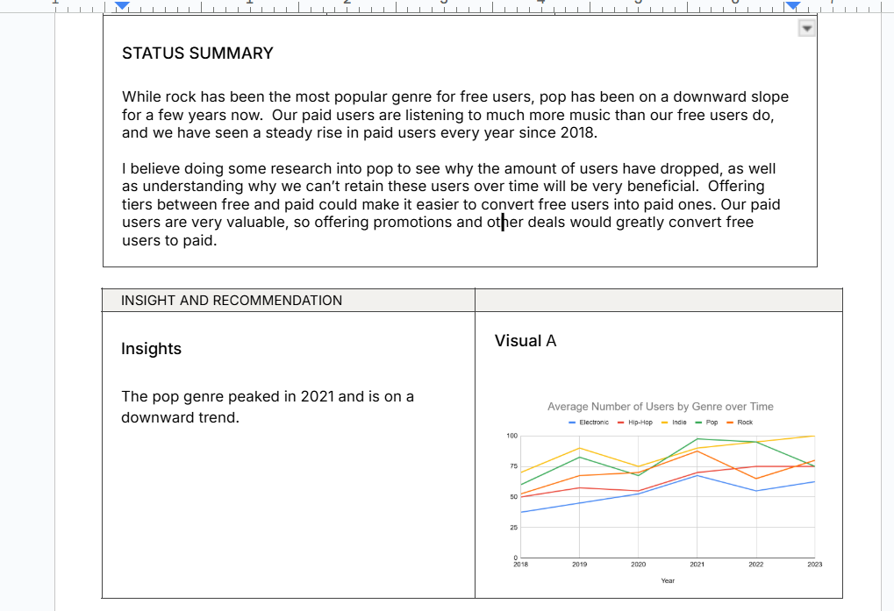

# PROJECT STATUS REPORT

## Overview
* Fresh Beats is a dynamic online platform transforming the music industry by integrating a streaming service for music enthusiasts with a launchpad for emerging artists. The platform bridges the gap between listeners and new talent, fostering community-driven music discovery and artist empowerment.  The problem we are solving for in this project is what genres of music require more attention to enhance performance.  

### Dataset

1. I received the data on google sheets.

### Method of statements

1.  Went Over all of the information and data.
2.  Analyze what info would work better for each different genre.
3.  copy and pasted the correct graphs with the correct info.

### Images

### Technologies
* To build this app latest technologies were used, using React hooks and Redux for state management. As for Css this app uses Material UI for some parts, and the most using css grid/flex. 

- React JS
- React Router
- Redux, Redux-Thunk
- MaterialUI
- SCSS modules

### Installing 
* Clone the Repo and run npm install and npm run to run on localhost

[Click here to see live Version --> ](https://newmovies.netlify.app)
